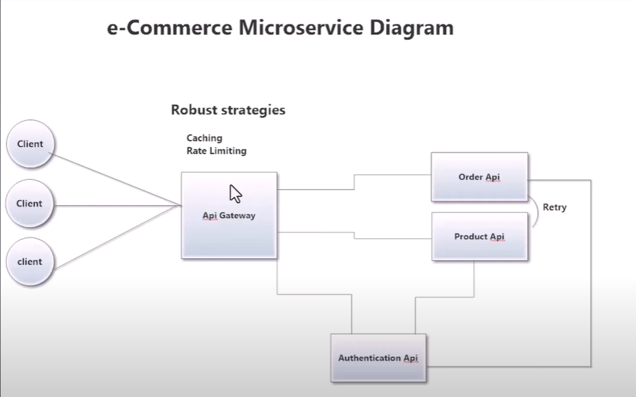

# eCommerce Microservice in .NET
We will have the below services as part of this project
- Product Api
- Orders Api
- Authentication Api (JWT Authentication - Role based authorization)
- Ocelot based Api Gateway

Architecture Pathern: Clean Architecture. 
Synchronous/Asynchronous communication between API Services.

Architecture Diagram:

# How it works: 
External Clients interacts with the system using the API Gateway. 
Api Gateway can connect to all the three Products, Orders and Authentication API's. 
Order API can make a request to the Product API with Retry Poicy in place. 
We will have a single SQL Server based database for both the service. 
We will also implement Caching and Rate Limiting(Return 429) in the Api Gateway for resiliency. 

# Solution Architecture: 
- Shared Library => For Logging, Authentication, Sql Server Common Repository Pattern, Common Response Pattern for API's
	Microsoft.AspNEtCore.Authentication.JwtBearer
	Microsoft.EntityFrameworkCore
	Microsoft.EntityFrameworkCore.SqlServer
	Serilog.AspNetCore
- Product/Orders API Solution
	Projects are: Presentation --> Infrastructure --> Application --> Doman + SharedLibrary
		Domain: 
			Responsible for containing entities models that represents the database table objects
		Aplication:
			Responsible for containing DTOs that represents the UI side objects
			Contains Mappers to convert the Entities to DTO and vice-versa
			Defines Repository interface to interact with the database
			For OrdersApi.Application:
			    We added Microsoft.Extensions.Http, Polly.Core, Polly.Extensions nuget packages.
			    This is because, OrdresApi will call the ProductsApi using a Polly Retry mechanism. 
		Infrastructure:
			Responsible for implementing the database repository interface
			Responsible for initializing the DbContext for the Service/Api
			Responsible for registering the services wiht container extensions
			Contains Migrations
			    add-migration ProductMigration -o Data/Migrations
			    update-database
			In Orders Api:
				Microsoft.Extensions.DependencyInjection
				Microsoft.Extensions.DependencyInjection.Abstractions
		Presentation: 
			Microsoft.EntityFrameworkCore.Tools
- Orders API Solution 
- Authentication API Solution 
- API Gateway Solution 

This is to simulate that these are handled by different teams. 
In Production, Shared library is a nuget package, but for the sake of development here we will reference the project in required solutions. 

# Softwares we require:
- Visual Studio/Visual Studio Code
- Postman for API Testing
- SQL Server for database. 

# Best Practices
Avoid using static classes as they are not testable.